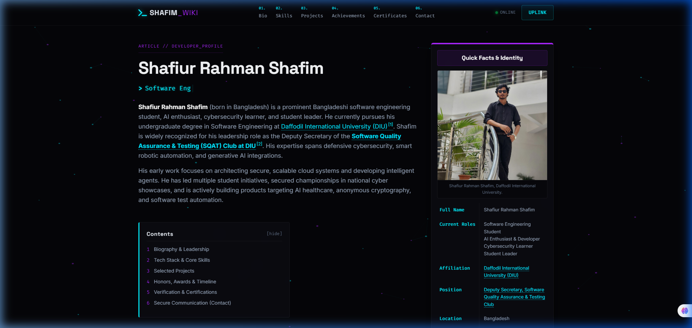

# Wikipedia-Cyberpunk Portfolio: Shafiur Rahman Shafim

A high-end, premium hybrid developer landing page styled with a combination of **Wikipedia's clean layout architecture** and **modern glowing Cyberpunk aesthetics**. Fully responsive, performant, and optimized for deployment on GitHub Pages or Vercel.

---

## 🚀 Live Demonstration
* **Live Deployment:** [shafiur-rahaman-shafim.vercel.app](https://shafiur-rahaman-shafim.vercel.app/)

### 📸 Visual Preview
Here is how the hybrid Wikipedia-Cyberpunk interface renders in production:

#### 1. Main Hero & Info Grid


#### 2. Quick Facts Infobox


#### 3. Simplified King-Logo Footer


---

## 🎨 Visual Identity & Theme
This landing page merges two contrasting digital interfaces:
1. **Wikipedia Layout Style:**
   - Left-column Wikipedia-style lead intro paragraphs and table of contents.
   - Right-column Wikipedia Quick Facts Infobox with profile metrics and link coordinates.
   - Bottom-anchored **References & Citation Registry** matching standard Wikipedia article layouts.
2. **Cyberpunk Neon Accents:**
   - Pure black and dark slate canvas background (`#050508`).
   - Glowing neon color space using Neon Cyan, Electric Purple, and Hot Pink.
   - Interactive project filter grid, card hover transitions, and a scroll progress indicator.
   - Smooth typewriter terminal command simulation in the hero section.

---

## 🛠️ Tech Stack & Dependencies
* **Core:** Semantic HTML5, Vanilla CSS3 (Custom properties/CSS Variables), Vanilla JavaScript (ES6+).
* **Typography:** Space Grotesk (Headings), Inter (Body copy), Fira Code (Monospace terminal elements).
* **Iconography:** Font Awesome v6.5.1 (Upgraded brand support for X, Discord, GitHub, etc.).

---

## 📂 Repository Structure
```bash
├── index.html          # Main HTML structure, Infobox, and References
├── style.css           # Custom layout tokens, theme classes, and neon animations
├── script.js          # Interactive filters, typewriter, scroll progress, and terminal
├── shafim_avatar.jpg   # Main profile photograph
├── README.md           # Repository documentation
└── walkthrough.md      # Development progress log and verification screenshots
```

---

## ⚙️ Setup & Local Development

To run this project locally, you don't need any complex compiler setups or bundlers—it runs on native web technologies.

1. **Clone the Repository:**
   ```bash
   git clone https://github.com/Shafiur0/about-me.git
   cd about-me
   ```

2. **Serve Locally:**
   You can serve the static files using any simple server utility. For example, using `npx`:
   ```bash
   npx http-server -p 8080
   ```

3. **Browse:**
   Open your browser and navigate to `http://localhost:8080` to inspect the layout.

---

## 🎓 Identity Coordinates
* **Full Name:** Shafiur Rahman Shafim
* **Affiliation:** Department of Software Engineering, [Daffodil International University (DIU)](https://daffodilvarsity.edu.bd)
* **Leadership Role:** Deputy Secretary, [Software Quality Assurance & Testing (SQAT) Club at DIU](https://www.facebook.com/profile.php?id=61561800885287)
* **Primary Interests:** Full-Stack Software Engineering, AI Integrations, Cybersecurity Research.

---

## 📜 License
Text and content are available under the Cyber-Creative Commons Attribution-ShareAlike License. All source code is open-source and free to use.

---
*Developed with 👑 by Shafiur Rahman Shafim*
