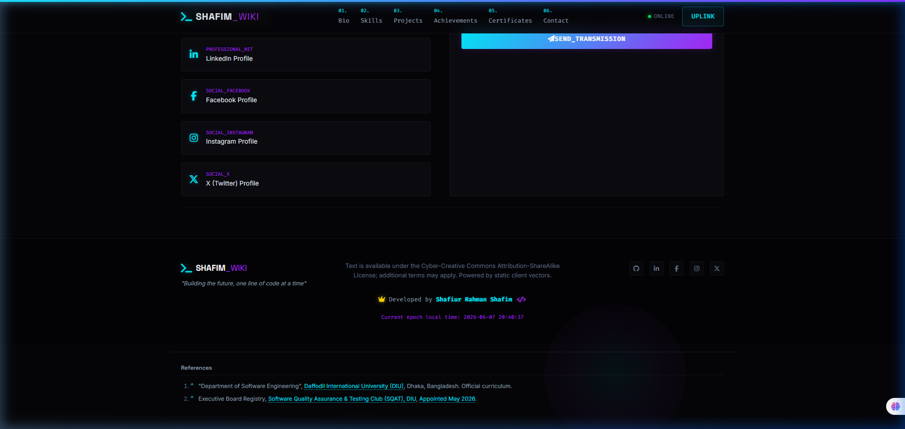
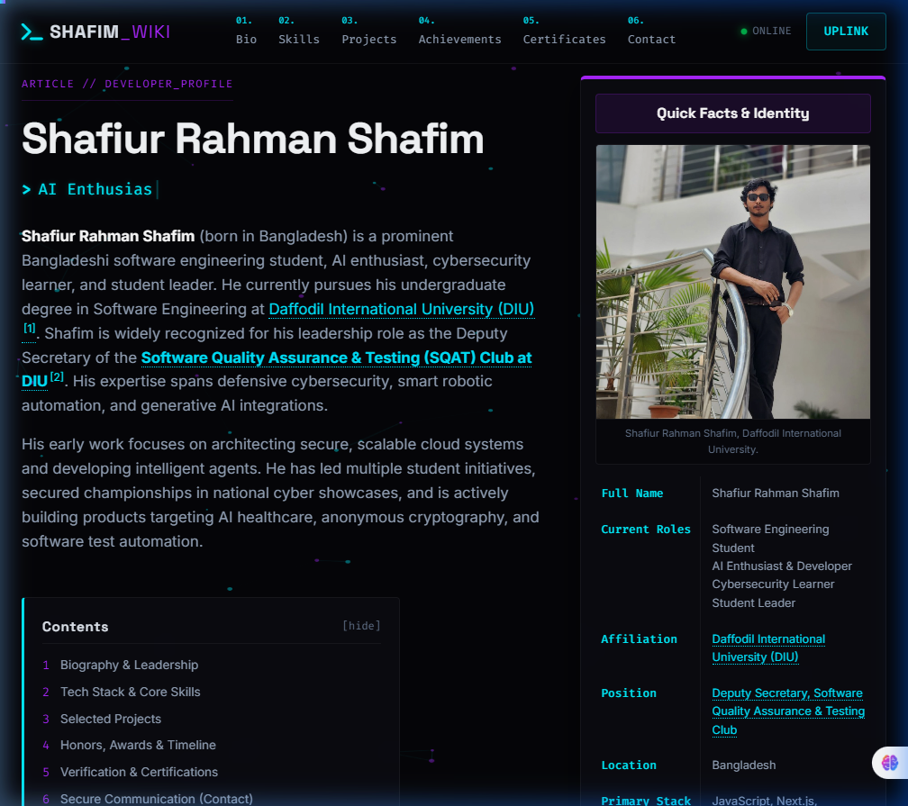

# Walkthrough - Wikipedia-Cyberpunk Portfolio

I have refined the hybrid Wikipedia-Cyberpunk landing page for **Shafiur Rahman Shafim**. The static site is fully responsive, interactive, and optimized for deployment on GitHub Pages.

## Changes Made

### 1. Avatar Image Update
- Replaced the cyberpunk placeholder avatar image with the user's uploaded portrait photo (`shafim_avatar.jpg`) across the meta tags and main profile infobox.

### 2. Font Awesome Upgrade & X Brand Logo Fix
- Upgraded the Font Awesome Icons package to version `6.5.1` in [index.html](file:///d:/about%20me/index.html) (line 33). This solves the missing X icon rendering issue by providing native support for the new `fa-x-twitter` branding class.
- The X logo now displays correctly in the Hero infobox coordinates, the secure contact grid, and the page footer.

### 3. GitHub Stats Section Removal & Navigation Renumbering
- Completely removed the former "Version Control & Statistics" section from the layout.
- Renumbered all navigation bar links, Table of Contents anchors, and section headers accordingly, making **06. Secure Communication (Contact)** the final section.

### 4. Card & Title Hyperlinks
- Wrapped headings in [index.html](file:///d:/about%20me/index.html) with descriptive `<a>` tags matching the provided URLs.
- Added visual link indicators (`.title-link-icon` from Font Awesome's `fa-arrow-up-right-from-square`) so users know the text is an external hyperlink.
- Applied links to all specified Projects, Achievements, and Certifications.
- Added dedicated CSS styles in [style.css](file:///d:/about%20me/style.css) so titles remain white by default but transition to a glowing neon cyan on hover.

### 5. Developer Credit Enhancement
- Enhanced the custom visual credit box in the footer to render the developer's title, **Deputy Secretary, Software Quality Assurance & Testing Club**, on a second line.
- Linked this title directly to the user's executive promotion announcement post: `https://www.facebook.com/photo/?fbid=122112039584393362&set=a.122105207846393362&_rdc=1&_rdr#`.
- Refined the CSS in [style.css](file:///d:/about%20me/style.css) to support this multi-line structure and add glowing transitions on hover.

### 6. DIU & SQAT Club Reference Link Integration
- Added the Department's university link pointing to the official website `https://daffodilvarsity.edu.bd` within the **References** section (Reference #1).
- Added the promotion/appointment link pointing to the Facebook photo post within Reference #2 for "Appointed May 2026".

### 7. Google Site Verification
- Added the Google site verification meta tag `<meta name="google-site-verification" content="HfGjhHQo8b99qjy9jC3gZS1ObVFfgmWdEdEYsEk9HL4" />` to the `<head>` of [index.html](file:///d:/about%20me/index.html).
- Removed the deprecated HTML verification file (`google864630410e5d0d5f.html`).

### 8. IEEE ICADHI Congress Achievement & Citation Link Fix
- Added the **1st Runner-Up at ICADHI IEEE Congress (Project Showcase)** entry to the **Achievements & Timeline** section (June 16, 2026).
- Integrated **Reference #3** pointing to the official Facebook announcement for the ICADHI IEEE Congress showcase award.
- Corrected the superscript citation `[1]` for the Daffodil International University link in the lead paragraph by wrapping it in a citation link pointing directly to the References section at the bottom of the page, ensuring full layout consistency.

---

## Verification & Test Results

We verified all core segments and interactive states using automated browser rendering.

### 1. Lead Paragraph & SQAT DIU Link
The lead paragraph correctly links the Department of Software Engineering (DIU) and the SQAT Club to their official pages. Superscript citations `[1]`, `[2]`, and `[3]` are all correctly linked to their respective footnote references in the wiki-style reference registry at the bottom.

### 2. Avatar & Profile Infobox
The infobox successfully renders the custom avatar image (`shafim_avatar.jpg`), and the X branding icon is visible.

### 3. Projects & Filters
Filtering tags isolate projects by domain (AI, Web, Robotics, Utilities) with smooth opacity transitions. Titles display arrow indicators next to them and change to neon cyan on hover.

### 4. Footer Developer Credit & References
The developer credit box has been simplified to a clean, borderless single-line layout featuring a gold crown icon and code tags (`</>`) without any surrounding box or dashed border. References #1, #2, and #3 correctly link to Daffodil International University, the Facebook appointment post, and the IEEE Congress showcase announcement.

### 5. Quick Facts Infobox (Position Link)
The "Position" row inside the Quick Facts infobox has been linked directly to the Facebook promotion post.

